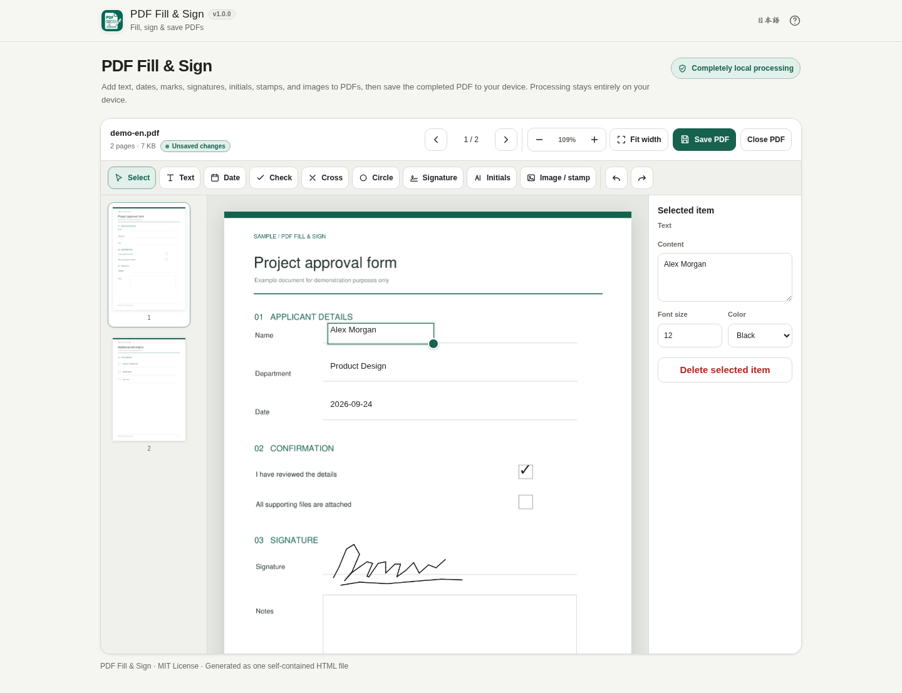

# PDF Fill & Sign

[](https://github.com/ttomohisa/htmlapps-pdf-fill-sign/actions/workflows/deploy-pages.yml)
[](LICENSE)
[](https://ttomohisa.github.io/htmlapps-pdf-fill-sign/)

[日本語版 README](README.ja.md)

A local, single-HTML tool for filling PDFs, adding visual signatures and images, and saving the completed PDF without uploading the selected document to a server.

## 🚀 Live demo

### [Open PDF Fill & Sign on GitHub Pages](https://ttomohisa.github.io/htmlapps-pdf-fill-sign/)

GitHub Pages delivers the initial HTML. After it loads, PDF parsing, form editing, overlay editing, signatures, image placement, and PDF export are processed locally on your device. The PDF you select is not uploaded by the app.

[](https://ttomohisa.github.io/htmlapps-pdf-fill-sign/)

[日本語の画面](assets/screenshot.png) · [Mobile screenshot](assets/screenshot-mobile.png)

## Features

- **Fill existing PDF forms** — Edit common AcroForm text fields, multiline fields, checkboxes, radio buttons, dropdowns, and choice lists.
- **Add content anywhere** — Place text, dates, ✓ / × / ○ marks, handwritten signatures, initials, and PNG / JPEG / WebP images over the PDF.
- **Keep editable additions as vectors where practical** — Text/date additions are saved as PDF FreeText annotations; ✓ / × / ○ and newly drawn signatures/initials are saved as vector Ink annotations.
- **Keep image assets as images** — Uploaded signature images, stamps, photos, logos, and other image-based assets remain raster annotations.
- **Work comfortably on desktop and mobile** — Includes thumbnails, zoom, cursor-anchored `Ctrl/Cmd + wheel` zoom, touch panning, pinch zoom, and a phone bottom action bar.
- **Undo and redo editing** — Browser Kitty additions and supported form-value changes participate in editing history.
- **Save a completed copy** — Export to a new `-filled.pdf` file without overwriting the source PDF.
- **Private, single-HTML operation** — PDF.js and its Worker are embedded, runtime networking is blocked with `connect-src 'none'`, and no account is required.

## Quick start

### Use the web demo

Open the GitHub Pages demo, choose a PDF, fill or annotate it, then save the completed PDF. No installation or account is required.

### Use the standalone HTML

Build the repository once, then copy `dist/index.html` or `dist/index.self-extract.html` wherever you want to use it. The generated app is designed to run without runtime network access, including local `file://` use.

## Usage

1. Open one PDF. On desktop you can also drag and drop it onto the start screen.
2. If the PDF contains supported form fields, fill them directly. Use `Tab` / `Shift+Tab` or the previous/next field controls to move between fields.
3. Use **Text**, **Date**, **✓**, **×**, or **○** to add content outside form fields.
4. Use **Signature** or **Initials** to draw with a mouse, finger, or pen, or choose an image-based asset.
5. Use **Image / Stamp** to place a PNG, JPEG, or WebP image.
6. Select Browser Kitty-added items to move, resize, edit, or delete them. Text/date items use one consistent local sans-serif stack and allow font-size and color adjustment.
7. Choose **Save PDF**. Leave **Flatten entered values** enabled for a visually fixed form result, or turn it off when supported form fields should remain interactive.
8. Save the generated PDF. The original file is not overwritten.

### Keyboard shortcuts

| Shortcut | Action |
| --- | --- |
| `Tab` / `Shift + Tab` | Next / previous supported PDF form field |
| `Ctrl` / `⌘` + `Z` | Undo when not typing in a field |
| `Ctrl` / `⌘` + `Shift` + `Z` or `Ctrl` / `⌘` + `Y` | Redo |
| `Ctrl` / `⌘` + wheel | Zoom around the cursor in the PDF preview |
| `Delete` / `Backspace` | Delete the selected Browser Kitty item when not typing |
| `Esc` | Clear the current selection/tool |
| Arrow keys | Move the selected Browser Kitty item |
| `Shift` + Arrow | Move it by a larger amount |

## PDF forms and flattening

Supported form types include single-line text, multiline text, checkbox, radio button, dropdown/choice list, read-only display fields, and signature fields used as visual placement guidance.

**Flatten entered values** is enabled by default. Browser Kitty writes the current field appearance into the PDF and hides the original widget from viewing and printing. This is a visual/non-interactive flattening strategy; it does not physically remove the underlying AcroForm field dictionaries.

When flattening is disabled, supported form fields remain editable where the source PDF and PDF.js save path allow it.

## Privacy and runtime network protection

PDF files, form values, signatures, images, and edits are processed in the browser. The app does not upload selected PDFs, use analytics or telemetry, load runtime assets from a CDN, fetch remote fonts, or call an external API.

The generated HTML uses a Content Security Policy containing `connect-src 'none'`. PDF.js and its Worker are embedded by the build pipeline.

The selected PDF and editing session are not persisted. Signature or initials assets are stored in IndexedDB only when you explicitly enable **Save on this device**; saved assets can be deleted from the signature dialog. The language preference may also be stored locally.

## Mobile behavior

At phone widths, the app shows persistent **Tools / Pages / Selected / Save** actions at the bottom of the viewport. **Selected** is enabled only when a Browser Kitty-added item is selected.

The PDF stage supports one-finger panning and two-finger pinch zoom. Dialogs use viewport limits, internal scrolling, and safe-area padding so signature and save flows remain usable on short and landscape phone screens.

## Limitations

- One PDF at a time
- Maximum input size: 100 MiB
- Password-protected PDFs are not opened yet
- XFA form fields are not edited; Browser Kitty overlays can still be placed over the page
- PDF signature fields are not cryptographically signed; Browser Kitty places a visual signature only
- Certificate-based digital signatures, identity verification, signature requests, audit trails, and contract-management workflows are outside the scope
- Required-field warnings are advisory and do not block export
- Text/date additions are PDF FreeText annotations, but the app does not embed a Browser Kitty-supplied Japanese font file into those annotations
- Uploaded image-based signatures, stamps, photos, logos, PNG, JPEG, and WebP assets remain raster
- Flattening hides form widgets and writes their appearance; it does not structurally delete AcroForm objects

## Browser support

Primary targets are current Chrome and Edge. Firefox, Safari, iOS Safari, and Android Chromium are compatibility targets.

## Development and build layout

```text
.
├─ src/index.template.html       # Application template
├─ dependencies.json             # Pinned runtime dependency declaration
├─ dependencies.lock.json        # Verified dependency lock data
├─ build-standalone.bat          # Windows build entry point
├─ build-standalone.ps1          # Standalone HTML builder
├─ assets/favicon.svg
└─ .github/workflows/
   ├─ build-standalone.yml       # Pull request/build validation
   └─ deploy-pages.yml           # GitHub Pages deployment
```

## Build

On Windows PowerShell 7:

```powershell
./build-standalone.ps1
./scripts/check-repository.ps1
```

Generated files are written under `dist/`. Do not edit generated HTML manually.

## Dependencies

| Library | Version | License | Purpose |
| --- | ---: | --- | --- |
| PDF.js / `pdfjs-dist` | 6.3.289 | Apache-2.0 | PDF loading, rendering, forms, annotations, and saving |

See [THIRD_PARTY_NOTICES.md](THIRD_PARTY_NOTICES.md) for license details.

## Contributing

Bug reports and feature proposals are welcome through GitHub Issues. See [CONTRIBUTING.md](CONTRIBUTING.md) for development guidance.

## License

Copyright © 2026 ttomohisa

Licensed under the [MIT License](LICENSE).
